**原文文件**: https://www.kaggle.com/whitepaper-embeddings-and-vector-stores?_gl=1*1iwgrjw*_ga*MTI1MTc2MTAzMi4xNzY2NjI4NjQw*_ga_T7QHS60L4Q*czE3NjY2MzcxMTkkbzMkZzEkdDE3NjY2Mzc0NjAkajYwJGwwJGgw
Authors: Anant Nawalgaria, Xiaoqi Ren, and Charles Sugnet

---


---


### Acknowledgements
#### Content contributors
Antonio Gulli
Grace Mollison
Ruiqi Guo 
Iftekhar Naim
Jinhyuk Lee
Alan Li
Patricia Florissi
Andrew Brook
Omid Fatemieh
Zhuyun Dai
Lee Boonstra
Per Jacobsson
Siddhartha Reddy Jonnalagadda
Xi Cheng
Raphael Hoffmann

#### Curators and Editors
Antonio Gulli
Anant Nawalgaria
Grace Mollison

#### Technical Writer
Joey Haymaker

#### Designer
Michael Lanning


---


> [!NOTE]
> ```
> 现实世界数据的低维数值表示，通过对原始数据进行有损压缩，显著提升了大体量数据处理与存储的效率
> ```

# 简介
现代机器学习离不开各种各样的数据，比如图片、文字和声音。这本白皮书主要研究“embedding”技术的作用，它可以把这些完全不同的数据转换成统一的向量，方便在各种程序中直接使用。 通过本文，你将了解到：

* **什么是嵌入**：为什么处理多模态数据必须用到它，它能用在哪些地方。 
* **嵌入的方法**：如何把不同类型的数据映射到同一个向量空间里。
- **高效管理**：海量嵌入向量的存储、检索与搜索技术。 
- **向量数据库**：用于管理和查询嵌入向量的专用系统，涵盖生产环境部署中的实际考量因素。
- **实际应用**：探讨将嵌入技术、向量数据库与大语言模型（LLM）相结合以解决现实问题的具体案例。 

在本白皮书中，我们将贯穿使用代码片段，为您直观地演示相关关键概念的实际操作。
# 为什么嵌入很重要
**本质上，嵌入（Embedding）是文本、语音、图像或视频等现实世界数据的数值表示。** “嵌入”这一名称源于数学中的一个相似概念，即一个空间可以被映射或“嵌入”到另一个空间中。例如，原始的 BERT 模型能将文本嵌入到一个 768 维的数值向量中，从而将包含所有句子的极高维空间映射到一个小得多的 768 维空间。嵌入被表现为低维向量，在向量空间中，两个向量之间的**几何距离**正是它们所代表的两个现实世界对象之间**关联性与语义相似度**的投影。 换句话说，嵌入不仅能帮助你为不同类型的数据提供紧凑的表示，还能让你在数值尺度上比较两个不同的数据对象，并判断它们的相似或差异程度。例如：单词“计算机”与计算机的图片以及单词“笔记本电脑”具有相似的含义，但与单词“汽车”则不相似。这些针对现实数据的低维数值表示，通过作为原始数据的有损压缩手段，在保留重要语义属性的同时，显著提升了大体量数据处理与存储的效率。 

**为了直观理解嵌入，可以参考我们熟悉的经纬度。** 经纬度将地球上的位置映射为一对数字，即长度为 2 的向量。经纬度可以被看作是特定位置的一种“嵌入”。虽然现在看来显而易见，但这种将位置映射为数字对的简单方法彻底改变了人类的导航方式，至今仍至关重要。已知两个地址的经纬度，就可以相对轻松地计算出它们的距离，或查找附近的地点。 与经纬度类似，如果两个文本嵌入在空间中相互靠近，那么它们的文本语义也将是相似的。此外，通过在该向量空间中寻找邻近区域，还可以发现语义相似的新短语。这种利用**向量数据库**在海量数据集中以极低延迟查找相似项的能力，对于当今许多生产用例至关重要，包括搜索、推荐、广告、欺诈检测等。需要注意的是，经纬度嵌入模型是基于地球球体形状设计的，而文本的嵌入空间则是通过**神经网络模型学习**得到的。重要的是，不同模型学习到的嵌入是不可互比的，因此在实践中确保使用兼容且一致的嵌入版本至关重要。 

**嵌入的核心应用领域是检索与推荐**，其结果通常需要从海量的搜索空间中筛选。例如，Google 搜索就是在整个互联网的搜索空间内进行的检索任务。如今检索和推荐系统的成功取决于以下步骤： 
1. 为搜索空间中的数十亿个项目**预计算**嵌入。 
2. 将**查询（Query）请求**的嵌入映射到同一个嵌入空间。 
3. 高效计算并检索出那些在空间中作为查询嵌入**最近邻**的项目。 


**嵌入在多模态领域也大放异彩。** 许多应用涉及处理大量不同模态的数据：如文本、语音、图像和视频等。**联合嵌入（Joint embeddings）**是指将多种类型的对象映射到同一个嵌入空间中，例如根据文本查询来检索视频。这些嵌入表示旨在尽可能多地捕捉原始对象的特征。
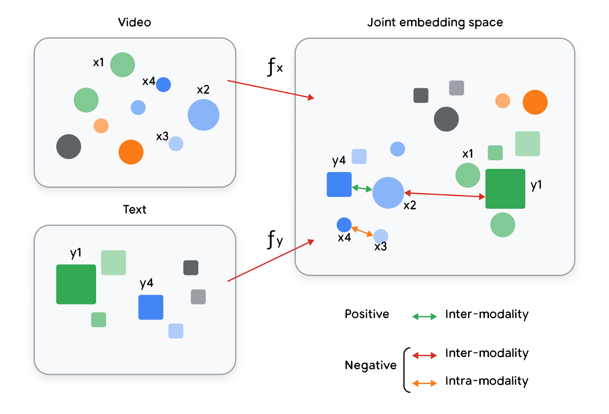
Figure 1. Projecting objects/content into a joint vector space with semantic meaning

嵌入的设计初衷是将具有相似语义属性的对象在嵌入空间中排列得更近（嵌入空间是一个可以投影项目的低维向量空间）。随后，这些嵌入可以作为**下游应用**中精炼且富有含义的输入。例如，你可以将它们作为机器学习模型、推荐系统、搜索引擎等的特征。因此，你的数据不仅获得了一种紧凑的数值表示，而且这种表示还保留了针对特定任务或跨多种任务的语义特征。由于这些表示具有**任务特定性**，这意味着你可以针对同一个对象生成不同的嵌入，并根据当前的任务进行优化。


---

# 评估嵌入质量

嵌入模型的评估方式因任务而异。许多衡量质量的通用指标都集中在模型**检索相似项并剔除不相似项**的能力上。这类评估需要已标注的数据集（即已知相关文档或正确文档的数据集），如代码片段 0（Snippet 0）中使用 NFCorpus 数据集来演示不同的指标。针对上述搜索应用场景，评估质量有两个重要指标： 
1. **精确率 (Precision)**：指检索出的所有文档都应该是相关的。 
2. **召回率 (Recall)**：指所有相关的文档都应该被检索出来。

直观地说，最理想的嵌入模型应该检索出所有相关文档，且不包含任何无关文档。然而，实际情况通常是部分相关文档被排除在外，而部分无关文档被检索出来，因此需要更量化的定义来评估大规模文档集和嵌入模型的质量。
* **精确率**的计算方法是：相关文档数量除以检索到的文档总数。它通常针对特定的检索数量来引用。例如，如果一个嵌入模型检索了 10 个文档，其中 7 个相关，3 个不相关，那么 **Precision@10** 就是 7/10 = 0.7。 
* **召回率**衡量检索到了多少比例的相关文档，计算方法是：检索到的相关文档数量除以语料库中相关文档的总数。召回率也通常针对特定的检索数量来引用。例如，如果检索了 20 个文档，其中 3 个是相关的，但语料库中总共有 6 个相关文档，那么 **Recall@20** 就是 3/6 = 0.5。

当相关性评分是二元（相关或不相关）时，精确率和召回率非常有用，但它们无法捕捉到“某些文档比其他文档更相关”的情况。例如，使用搜索引擎时，用户对结果的排序非常敏感，因此最相关的结果排在列表顶端是极其重要的。当已知数据集中文档相关性的详细排序时，可以使用**归一化折损累计增益 (nDCG)** 等指标来衡量嵌入模型生成的排名与理想排名之间的质量差异。
$$ DCG = \sum_{i=1}^{p} \frac{rel_i}{\log_2(i+1)} $$在 DCG 的计算公式中，分母会对排名靠后的文档进行“惩罚”，只有当最相关的文档排在最前面时，DCG 的分值才会最大化。其归一化版本（nDCG）通过将 DCG 分数除以理想排序分数计算得出，范围从 0.0 到 1.0，便于在不同查询之间进行比较。
目前，**BEIR** 等公共基准测试被广泛用于评估检索任务的性能，而 **MTEB（大规模文本嵌入基准）** 等基准则涵盖了更多额外任务。建议从业者使用文本检索会议 (TREC) 发起的标准库（如 `trec_eval` 或其 Python 封装版本 `pytrec_eval`）来进行一致性基准测试，以计算精确率、召回率、nDCG 等指标。 
虽然评估特定应用的嵌入模型的最佳方式可能与具体业务相关，但“**越相似的对象在嵌入空间中应越接近**”这一直觉通常是一个良好的开端。此外，在生产环境应用中，模型大小、嵌入维度、延迟以及整体成本也是重要的考量因素。

# 搜索示例

在深入探讨不同类型的嵌入及嵌入模型的发展史之前，让我们先详细研究一下前文提到的搜索示例。其核心目标是：根据用户提出的查询（Query），在海量语料库中找到相关的文档。 一种实现方法是构建**联合嵌入模型（Joint embedding model）**，将问题和答案映射到嵌入空间中的相似位置。由于问题和答案在语义上往往不同（即使它们互为补充），因此通常使用两个共同训练的神经网络——一个针对问题，一个针对文档——会更有帮助。这种结构在图 9(b) 中表现为**异步双编码器（Asymmetric dual encoder）**，即查询和文档分别使用独立的网络；与之相对的是图 9(a) 所示的**孪生网络（Siamese network）**，它对查询和文档使用同一个神经网络。 
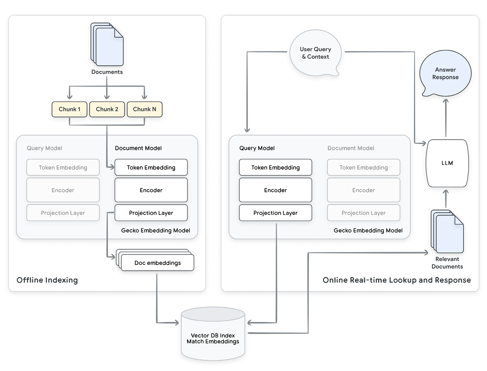

> [!NOTE] figure 2
> 重点展示嵌入技术的 RAG（检索增强生成）搜索应用流程示例。文档嵌入在后台生成并存储在向量数据库中。当用户输入查询时，系统利用双编码器中的“查询嵌入”部分生成向量，并据此查找相关文档。随后，这些文档可被插入到大语言模型（LLM）的提示词（Prompt）中，以便为用户生成相关的总结性回复。

图 2 展示了一个使用**检索增强生成（RAG）**方法的搜索问答应用流程。在该流程中，嵌入技术用于识别相关文档，随后将这些文档插入到大语言模型（LLM）的提示词（Prompt）中，以便为终端用户生成总结。该应用分为两个主要过程： 
1. **索引创建**：将文档划分为块（Chunks），并利用这些分块生成嵌入，随后存储在向量数据库中以实现低延迟搜索。具体而言，双编码器神经网络中的“文档嵌入”部分专门用于处理这些分块。 
2. **查询阶段**：当用户向系统提问时，系统使用模型的“查询嵌入”部分对问题进行编码，并通过向量数据库的相似度搜索映射到相关文档。这一阶段对**延迟极其敏感**，因为终端用户正在等待响应，因此能够利用文档向量数据库在毫秒级内从海量语料库中识别相关文档，是至关重要的基础设施。 

自 BERT 问世以来，嵌入模型的质量飞速提升，且目前尚无放缓迹象。虽然近期 AI 领域的目光大多集中在 LLM 上，但信息检索和嵌入模型的进步同样具有变革性。早期的 BERT 模型在当时是一个巨大的飞跃，其在 BEIR 基准测试中的平均得分为 10.6；而到了 **2025 年，来自 Google 的最新嵌入模型**（仅需简单的 API 调用，无需深厚的 AI 背景）在 BEIR 上的平均得分已达到 **55.7**。鉴于模型升级迭代极快，在将嵌入模型投入生产环境时，务必在设计上预留模型升级的空间。针对特定应用设计的评估套件对于确保平滑升级至关重要。选择具有成熟升级路径的平台可以节省开发时间并降低运维开销，例如下文的代码片段 0（Snippet 0）就展示了如何通过 Google Vertex 进行简单的 API 调用。 

**代码片段 1** 包含了一个基础的嵌入代码示例，通过包含医疗健康问题的 **NFCorpus 数据集**展示了上文提到的一些重要概念： 
* **高质高效**：使用 Google Vertex API 对相关文本文档进行嵌入。这里使用了 `RETRIEVAL_DOCUMENT` 任务类型，因为问题和答案的表述方式通常不同，使用单一模型计算语义相似度的性能往往不如使用“文档-查询”联合嵌入模型。
* **高效搜索**：使用 `faiss` 库存储嵌入并进行高效的相似度搜索。 
* **任务特定**：对于特定查询，使用 `RETRIEVAL_QUERY` 任务类型生成文本嵌入。 
* **距离度量**：通过 `faiss` 库，利用默认的欧几里得距离度量，根据查询嵌入查找距离相近的文档 ID。 * **质量评估**：生成所有查询的嵌入并检索最相似的文档，随后使用 `pytrec` 库对照“标准参考值（Gold values）”评估检索质量，衡量指标包括 **Precision@1、Recall@10 和 nDCG@10**。

```python
from beir import util
from beir.datasets.data_loader import GenericDataLoader
import faiss
import vertexai
from vertexai.language_models import TextEmbeddingInput, TextEmbeddingModel
import numpy as np
import pandas as pd
import pytrec_eval

def embed_text(texts, model, task, batch_size=5) :
	embed_mat = np.zeros((len(texts),768))
	for batch_start in range(0,len(texts),batch_size):
		size = min(len(texts) - batch_start, batch_size)
		inputs = [TextEmbeddingInput(texts[batch_start+i], task_type=task) for i in range(size)]
		embeddings = model.get_embeddings(inputs)
		for i in range(size) :
			embed_mat[batch_start + i, :] = embeddings[i].values
	return embed_mat
	
# Download smallish NFCorpus dataset of questions and document text
url = "https://public.ukp.informatik.tu-darmstadt.de/thakur/BEIR/datasets/nfcorpus.zip"
data_path = util.download_and_unzip(url, "datasets")
# Corpus of text chunks, text queries and “gold” set of query to relevant documents dict
corpus, queries, qrels = GenericDataLoader("datasets/nfcorpus").load(split="test")

# Note need to setup Google Cloud project and fill in id & location below
vertexai.init(project="PROJECT_ID", location="LOCATION")
model = TextEmbeddingModel.from_pretrained("text-embedding-005")
doc_ids,docs = zip(*[(doc_id, doc['text']) for doc_id,doc in corpus.items()])
q_ids,questions = zip(*[(q_id, q) for q_id,q in queries.items()])

# Embed the documents and queries jointly using different models
doc_embeddings = embed_text(docs, model, "RETRIEVAL_DOCUMENT")
index = faiss.IndexFlatL2(doc_embeddings.shape[1])
index.add(doc_embeddings)

# Example look up example query to find relevant doc - note using 'RETRIEVAL_QUERY'
example_embed = embed_text(['Is Caffeinated Tea Really Dehydrating?'],
model, 'RETRIEVAL_QUERY')
s,q = index.search(example_embed,1)
print(f'Score: {s[0][0]:.2f}, Text: "{docs[q[0][0]]}"')
# Score: 0.49, Text: "There is a belief that caffeinated drinks, such as tea,
# may adversely affect hydration. This was investigated in a randomised
# controlled trial ... revealed no significant differences
# between tea and water for any of the mean blood or urine measurements...”

# Embed all queries to evaluate quality compared to "gold" answers
query_embeddings = embed_text(questions, model, "RETRIEVAL_QUERY")
q_scores, q_doc_ids = index.search(query_embeddings, 10)
# Create a dict of query to document scores dict for pytrec evaluation
# Multiply scores by -1 for sorting as smaller distance is better score for pytrec eval
search_qrels = { q_ids[i] : { doc_ids[_id] : -1*s.item() for _id, s in zip(q_doc_ids[i], q_
scores[i])} for i in range(len(q_ids))}
evaluator = pytrec_eval.RelevanceEvaluator(qrels, {'ndcg_cut.10','P_1','recall_10'})
eval_results = evaluator.evaluate(search_qrels)
df = pd.DataFrame.from_dict(eval_results, orient='index')
df.mean()
#P_1 0.517028 // precision@1
#recall_10 0.203507 // recall@10
#ndcg_cut_10 0.402624 // nDCG@10
```

> [!NOTE] Snippet 1
> 语义搜索示例：使用文本嵌入技术并对检索文档的质量进行评估。


# 嵌入的类型
嵌入旨在获取原始数据的低维表示，同时保留大部分“核心信息”。嵌入所能表示的数据类型多种多样。下文将介绍一些用于不同类型数据（包括文本和图像）的标准技术。 
#### 文本嵌入 
文本嵌入作为自然语言处理（NLP）的一部分被广泛应用。它们通常用于在机器学习中嵌入自然语言的语义，以便在各种下游应用中进行处理，例如文本生成、分类、情感分析等。这些嵌入大致分为两类：**词元/词（Token/Word）嵌入**和**文档（Document）嵌入**。 
在深入探讨这些类别之前，了解文本的完整生命周期至关重要：从用户输入到最终转换为嵌入。

*Figure 3. The process of turning text into embeddings*

一切始于输入字符串，它被拆分成更小的、有意义的单元，称为“词元”（Tokens）。这一过程被称为**词元化（Tokenization）**。通常，根据所使用的分词技术，这些词元可以是词根（Wordpieces）、字符、单词、数字或标点符号。 字符串完成词元化后，每个词元会被分配一个唯一的整数值，范围通常在：[0, 语料库中词元总数的基数]。例如，对于一个包含 16 个单词的词汇表，其 ID 范围在 0 到 15 之间。该值也被称为**词元 ID（Token ID）**。这些词元可用于将每个字符串表示为文档的稀疏数值向量，直接用于下游任务，或在进行独热编码（One-hot encoding）后使用。 **独热编码**是分类值的一种二进制表示，其中单词的出现用 1 表示，未出现用 0 表示。这确保了词元 ID 被作为分类值处理，但通常会导致生成维度等同于语料库词汇量大小的稠密向量。代码片段 2 和图 4 展示了如何使用 TensorFlow 实现这一过程。

```python
# Tokenize the input string data
from tensorflow.keras.preprocessing.text import Tokenizer
data = [
"The earth is spherical.",
"The earth is a planet.",
"I like to eat at a restaurant."]

# Filter the punctiations, tokenize the words and index them to integers
tokenizer = Tokenizer(num_words=15, filters='!"#$%&()*+,-./:;<=>?[\\]^_'{|}~\t\n', lower=True,
split=' ')
tokenizer.fit_on_texts(data)

# Translate each sentence into its word-level IDs, and then one-hot encode those IDs
ID_sequences = tokenizer.texts_to_sequences(data)
binary_sequences = tokenizer.sequences_to_matrix(ID_sequences)
print("ID dictionary:\n", tokenizer.word_index)
print("\nID sequences:\n", ID_sequences)
print("\n One-hot encoded sequences:\n", binary_sequences)
```

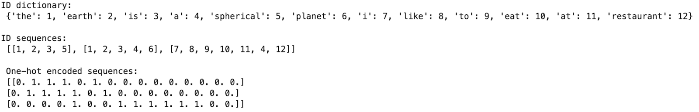
*Figure 4. Output of Snippet 2*

然而，由于这些整数 ID（及其对应的独热编码向量）是随机分配给单词的，它们**缺乏任何内在的语义含义**。这正是嵌入技术的优势所在。尽管也可以对字符级和子词（Sub-word）级词元进行嵌入，但接下来我们将重点讨论词嵌入和文档嵌入，以理解其背后的一些方法。
## 词嵌入（Word Embeddings）

在本节中，您将了解到几种用于训练和使用词嵌入的技术与算法，它们是当前所使用的现代文本嵌入技术的前身。尽管随着时间的推移，开发出了许多针对不同目标优化的机器学习（ML）算法，但其中最常用的包括 **GloVe**、**SWIVEL** 和 **Word2Vec**。此外，词嵌入或子词（sub-word）嵌入也可以直接从语言模型的隐藏层中获得。然而，在文本的不同语境下，同一个词对应的嵌入表示会有所不同。本节重点讨论轻量级、**无上下文（context-free）**的词嵌入，而将具有上下文感知能力的文档嵌入留在“文档嵌入”章节讨论。 词嵌入可以直接应用于命名实体提取（NER）和主题建模等下游任务。 

**Word2Vec** 是一系列模型架构，其运作原理是“词的语义由其邻居定义”，即在训练语料库中频繁出现在彼此附近的词。这种方法既可用于从大型数据集中训练您自己的嵌入，也可以通过在线获取现成的预训练嵌入来快速集成。 在训练开始时，每个词的嵌入（本质上是固定长度的向量）都会被随机初始化，从而产生一个形状为 `(词汇表大小, 每个嵌入的维度)` 的矩阵。训练完成后，该矩阵可作为**查询表（lookup table）**使用。训练通常采用以下两种方法之一（见图 4）： 
* **连续词袋（CBOW）方法**：尝试利用周围词的嵌入作为输入来预测中间词。该方法与语境中周围词的顺序无关，训练速度快，对于高频词的准确度略高。 
* **Skip-gram 方法**：其设置与 CBOW 相反，利用中间词来预测一定范围内的周围词。这种方法训练速度较慢，但在小规模数据上表现良好，且对罕见词的准确度更高。 

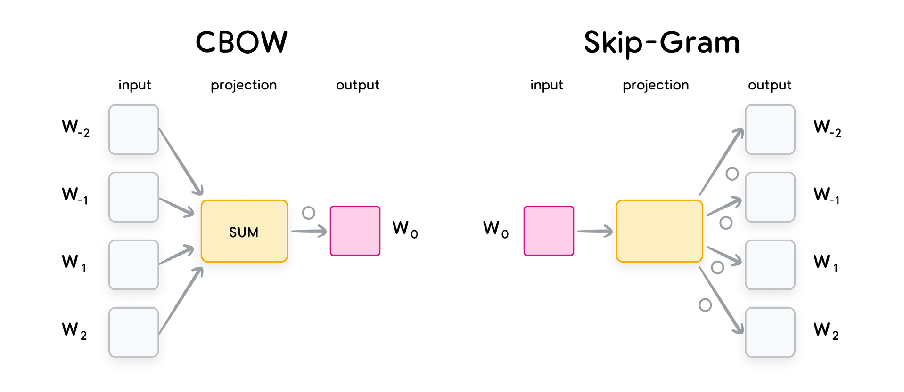
*Figure 5. Diagram explaining how CBOW and Skip-Gram methods work*

Word2Vec 算法还可以扩展到子词级别，这为 **FastText** 等算法提供了灵感。然而，Word2Vec 的一个主要局限在于，尽管它能很好地捕捉特定滑动窗口内的局部统计信息，但它无法捕捉**全局统计信息**（即整个语料库中的词频分布）。这一缺陷正是 GloVe 等方法所致力于解决的。 

**GloVe** 是一种同时利用词的全局和局部统计信息的词嵌入技术。它通过首先创建一个表示词之间关系的**共现矩阵（co-occurrence matrix）**来实现这一点。随后，GloVe 使用矩阵分解技术从共现矩阵中学习词表示。生成的词表示能够同时捕捉词的全局和局部信息，适用于多种 NLP 任务。 

除 GloVe 之外，**SWIVEL** 是另一种利用共现矩阵学习词嵌入的方法。SWIVEL 代表“带负采样的跳窗向量（Skip-Window Vectors with Negative Sampling）”。与 GloVe 不同，它通过考虑其邻近词固定窗口内的词共现来学习词向量。此外，SWIVEL 还考虑了**未观察到的共现**，并使用一种特殊的**分段损失（piecewise loss）**进行处理，从而提升了其在罕见词上的表现。通常认为它在平均准确度上仅比 GloVe 略低，但训练速度明显更快。这是因为它支持**分布式训练**，通过将嵌入向量细分为更小的子矩阵，并在多台机器上并行执行矩阵分解。 下文的代码片段 2 演示了如何加载 Word2Vec 和 GloVe 的预训练词嵌入，在 2D 空间中进行可视化，并计算最近邻。

```python
from gensim.models import Word2Vec
import gensim.downloader as api
import pprint
import matplotlib.pyplot as plt
from sklearn.manifold import TSNE
import numpy as np
def tsne_plot(models, words, seed=23):
	"Creates a TSNE models & plots for multiple word models for the given words"
	
	plt.figure(figsize=(len(models)*30, len(models)*30))
	model_ix = 0
	for model in models:
		labels = []
		tokens = []
	
	for word in words:
		tokens.append(model[word])
		labels.append(word)
	
	tsne_model = TSNE(perplexity=40, n_components=2, init='pca', n_iter=2500, random_state=seed)
	new_values = tsne_model.fit_transform(np.array(tokens))
	x = []
	y = []
	for value in new_values:
		x.append(value[0])
		y.append(value[1])
	model_ix +=1
	plt.subplot(10, 10, model_ix)
	for i in range(len(x)):
		plt.scatter(x[i],y[i])
		plt.annotate(labels[i],
			xy=(x[i], y[i]),
			xytext=(5, 2),
			textcoords='offset points',
			ha='right',
			va='bottom')
	plt.tight_layout()
	plt.show()
v2w_model = api.load('word2vec-google-news-300')
glove_model = api.load('glove-twitter-25')
print("words most similar to 'computer' with word2vec and glove respectively:")
pprint.pprint(v2w_model.most_similar("computer")[:3])
pprint.pprint(glove_model.most_similar("computer")[:3])
pprint.pprint("2d projection of some common words of both models")
sample_common_words= list(set(v2w_model.index_to_key[100:10000])
& set(glove_model.index_to_key[100:10000]))[:100]
tsne_plot([v2w_model, glove_model], sample_common_words)
```
*Snippet 3. Loading and plotting GloVe and Word2Vec embeddings in 2D*
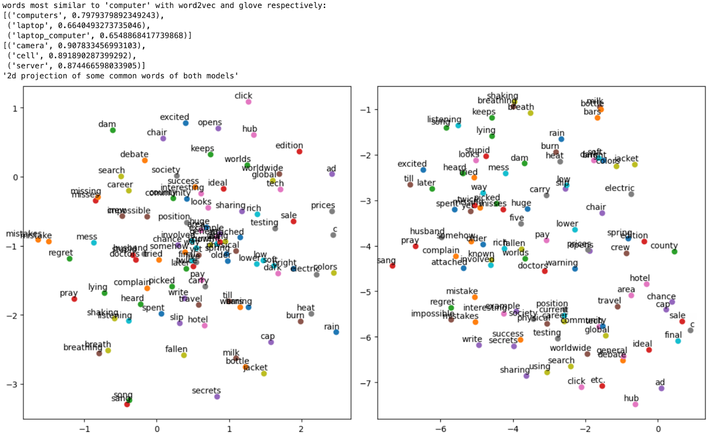
*Figure 6. 2D visualization of pre-trained GloVe and Word2Vec word embeddings*


---

# 文档嵌入（Document Embeddings）
将文档嵌入为低维稠密向量的研究兴趣自 20 世纪 80 年代以来经久不衰。文档嵌入可用于各种应用，包括语义搜索、主题发现、分类和聚类，旨在捕捉段落和文档中一系列词语的含义，并将其应用于各种下游任务。嵌入模型的发展演变主要可分为两个阶段：**浅层词袋（BoW）模型**和**深度预训练大语言模型**。

#### 浅层词袋（BoW）模型 
早期的文档嵌入工作遵循词袋（Bag-of-Words）范式，假设文档是单词的无序集合。这些早期作品包括**潜在语义分析（LSA）**和**潜在狄利克雷分配（LDA）**。LSA 利用文档中词语的共现矩阵，而 LDA 则使用贝叶斯网络来对文档嵌入进行建模。另一个著名的词袋系列是基于 **TF-IDF（词频-逆文档频率）**的模型，这是一种利用词频来表示文档嵌入的统计模型。基于 TF-IDF 的模型既可以是表示词级重要性的稀疏嵌入，也可以作为权重因子与词嵌入结合，生成文档的稠密嵌入。例如，基于 TF-IDF 的词袋模型 **BM25** 在当今的检索基准测试中仍然是一个强有力的基准（Baseline）。

然而，词袋范式有两个主要弱点：**忽略了词序和语义含义**。BoW 模型无法捕捉词语之间的顺序关系，而这对于理解含义和上下文至关重要。
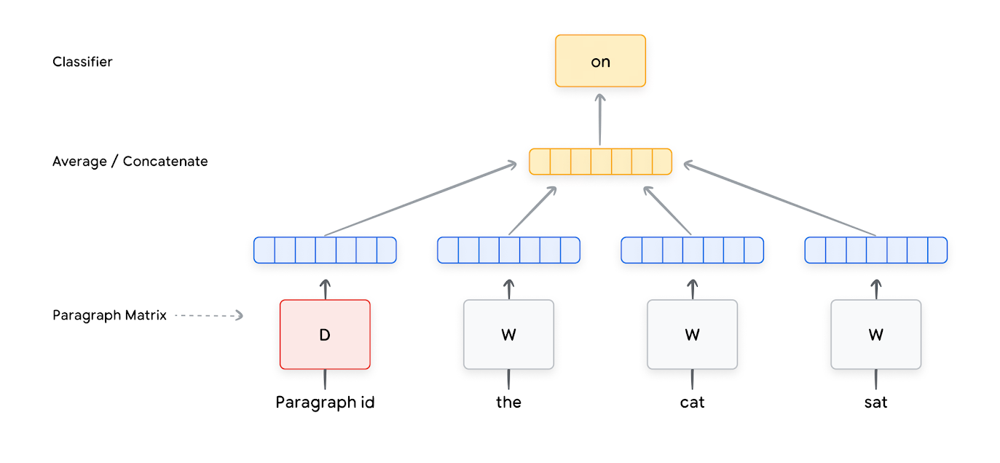
Figure 7. Doc2vec CBOW model

```python
from gensim.test.utils import common_texts
from gensim.models.Doc2Vec import Doc2Vec, TaggedDocument
from gensim.test.utils import get_tmpfile
#train model on a sequence of documents tagged with their IDs
documents = [TaggedDocument(doc, [i]) for i, doc in enumerate(common_texts)]
model = Doc2Vec(documents, vector_size=8, window=3, min_count=1, workers=6)
# persist model to disk, and load it to infer on new documents
model_file = get_tmpfile("Doc2Vec_v1")
model.save(model_file)
model = Doc2Vec.load(model_file)
model.infer_vector(["human", "interface"])
```
Snippet 4. Self-supervised Training and inference using Doc2Vec on private corpus

受 Word2Vec 启发，**Doc2Vec** 于 2014 年被提出，用于使用（浅层）神经网络生成文档嵌入。Doc2Vec 模型在 Word2Vec 的模型中增加了一个额外的“段落”嵌入（即文档嵌入），如图 6 所示。段落嵌入与词嵌入连接或取平均值，以预测段落中的随机词。训练完成后，对于现有文档，所学到的嵌入可直接用于下游任务；对于新文档，则需要执行额外的推理步骤来生成嵌入。 
#### 深度预训练大语言模型 
受深度神经网络发展的推动，各种嵌入模型和技术层出不穷，最前沿的模型正在飞速发展。这些模型的主要变化包括： 
1. 使用更复杂的学习模型，特别是**双向深度神经网络**模型。 
2. 在海量未标注文本上进行**大规模预训练**。 
3. 使用**子词词元生成器（Subword Tokenizer）**。 
4. 针对各种下游 NLP 任务进行**微调（Fine-tuning）**。

2018 年，**BERT**（来自 Transformer 的双向编码器表示）问世，在 11 项 NLP 任务上取得了突破性成果。BERT 所基于的 **Transformer** 模型范式已成为当今的主流。除了以 Transformer 作为模型骨干，BERT 成功的另一个关键在于使用海量未标注语料库进行预训练。在预训练中，BERT 利用**掩码语言模型（MLM）**作为目标，通过随机掩盖输入中的某些词元并预测被掩盖的 ID，使模型能够利用左右上下文来训练深度双向 Transformer。此外，BERT 还利用了**下一句预测（NSP）**任务。BERT 为输入中的每个词元输出一个上下文相关的嵌入。通常，第一个词元（名为 `[CLS]` 的特殊词元）的嵌入被用作整个输入的向量表示。
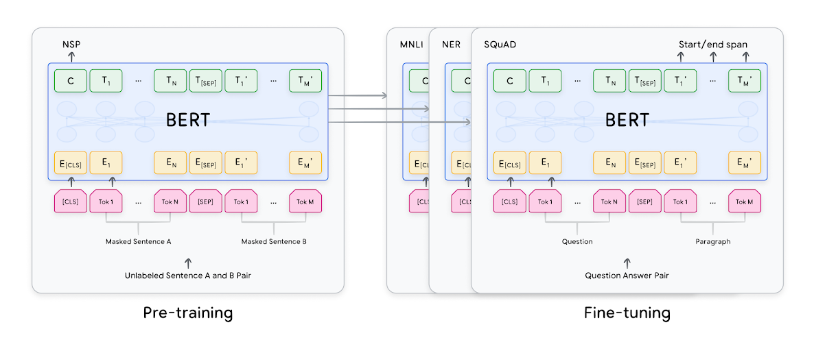
Figure 8. The BERT architecture

BERT 成为多个嵌入模型的基础，包括 **Sentence-BERT**、**SimCSE** 和 **E5**。与此同时，语言模型（尤其是大语言模型）的演进从未停止。2019 年提出的 **T5** 参数量达到 110 亿；2022 年的 **PaLM** 将参数量推向了惊人的 5400 亿。Google 的 **Gemini**、OpenAI 的 **GPT** 以及 Meta 的 **Llama** 等模型也正以惊人的速度迭代。 

基于大语言模型的新型嵌入模型不断涌现。例如，**GTR** 和 **Sentence-T5** 在检索和句子相似度任务上的表现分别优于 BERT 系列模型。最近，Vertex AI 发布了基于 Gemini 骨干网络的新型嵌入模型，在所有公开基准测试中均取得了卓越成绩。**Matryoshka Embeddings（俄罗斯套娃嵌入）** 则允许用户根据任务选择合适的维度，从而尽可能减少存储和索引所需的数据量。

另一种发展方向是生成**多向量嵌入（Multi-vector Embeddings）**而非单向量，以增强模型的表征能力。此类模型包括 **ColBERT** 和 **XTR**。**ColPali** 也采用了多向量方法，但将其应用从纯文本扩展到了文本与图像的联合嵌入，用于处理多模态文档。
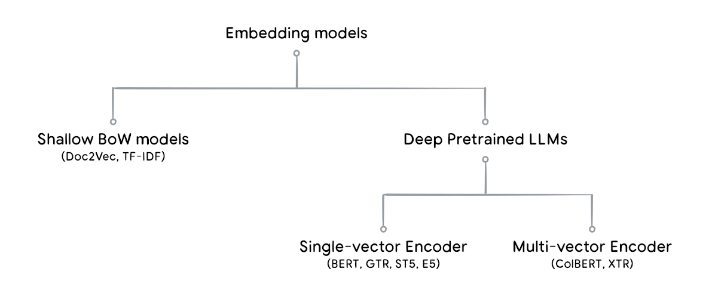
Figure 9. An illustration of the taxonomy diagram of the embedding models

尽管深度神经网络模型需要更多的数据和计算时间进行训练，但其性能远优于词袋范式模型。例如，对于同一个词，在不同语境下嵌入会不同，而词袋模型在定义上无法做到这一点。代码片段 4 展示了如何使用来自 Tensorflow-hub 或 Vertex AI 的预训练文档嵌入模型。Vertex 生成式 AI 文本嵌入可以与 Vertex AI SDK、LangChain 以及 Google BigQuery 配合使用（代码片段 5），实现进阶的工作流。

[^1]

```python
import vertexai
from vertexai.language_models import TextEmbeddingInput, TextEmbeddingModel

# Set the model name. For multilingual: use "text-multilingual-embedding-002"
MODEL_NAME = "text-embedding-004"
# Set the task_type, text and optional title as the model inputs.
# Available task_types are "RETRIEVAL_QUERY", "RETRIEVAL_DOCUMENT",
# "SEMANTIC_SIMILARITY", # "CLASSIFICATION", and "CLUSTERING"
TASK_TYPE = "RETRIEVAL_DOCUMENT"
TITLE = "Google"
TEXT = "Embed text."

# Use Vertex LLM text embeddings
embeddings_vx = TextEmbeddingModel.from_pretrained("textembedding-gecko@004")

def LLM_embed(text):
	def embed_text(text):
		text_inp = TextEmbeddingInput(task_type="CLASSIFICATION", text=text.numpy())
		return np.array(embeddings_vx.get_embeddings([text_inp])[0].values)
	output = tf.py_function(func=embed_text, inp=[text], Tout=tf.float32)
	output.set_shape((768,))
	return output
	
# Embed strings using vertex LLMs
LLM_embeddings=train_data.map(lambda x,y: ((LLM_embed(x), y))
# Embed strings in the tf.dataset using one of the tf hub models
embedding = "https://tfhub.dev/google/sentence-t5/st5-base/1"
hub_layer = hub.KerasLayer(embedding, input_shape=[],dtype=tf.string, trainable=True)

# Train model
model = tf.keras.Sequential()
model.add(hub_layer) # omit this layer if using Vertex LLM embeddings
model.add(tf.keras.layers.Dense(16, activation='relu'))
model.add(tf.keras.layers.Dense(1))
model.compile(optimizer='adam',loss=tf.keras.losses.BinaryCrossentropy(from_logits=True),
metrics=['accuracy'])
history = model.fit(train_data.shuffle(100).batch(8))
```

Snippet 4. Creating & integrating text embeddings (Vertex, Tfhub) into keras text classification models


```python
SELECT * FROM ML.GENERATE_TEXT_EMBEDDING(
MODEL my_project.my_company.llm_embedding_model,
(
SELECT review as content
FROM bigquery-public-data.imdb.reviews));
```
Snippet 5. Creating LLM based text embeddings in BigQuery for selected columns in a table

### 图像与多模态嵌入（Image & Multimodal Embeddings） 
与文本类似，也可以创建图像和多模态嵌入。
**单模态图像嵌入**可以通过多种方式获得，例如在规模巨大的图像分类任务（如 ImageNet）上训练 CNN 或 Vision Transformer（ViT）模型，然后将**倒数第二层**作为图像嵌入。该层学习了对训练任务至关重要的判别性特征图，并可以扩展到其他任务。 
要获得**多模态嵌入**，需要获取各自的单模态文本和图像嵌入，并通过另一个训练过程创建它们语义关系的**联合嵌入（Joint embedding）**。这使你在同一个潜空间（Latent space）中获得固定大小的语义表示。代码片段 6 计算了图像和文本的多模态嵌入。像 **ColPali** 这样的多模态嵌入方法使用图像模型，使得通过文本查询即可实现对多模态文档的检索，而无需复杂的 OCR 或版面预处理——该模型直接搜索在浏览器或 PDF 阅读器中显示的图像，而非将其转换为纯文本进行索引。
```python
import base64
import tensorflow as tf
from google.cloud import aiplatform
from google.protobuf import struct_pb2

#fine-tunable layer for image embeddings which can be used for downstream keras modelimage_
embed=hub.KerasLayer("https://tfhub.dev/google/imagenet/efficientnet_v2_imagenet21k_ft1k_s/feature_
vector/2",trainable=False)

class EmbeddingPredictionClient:
	"""Wrapper around Prediction Service Client."""
	def __init__(self, project : str,
	location : str = "us-central1",
	api_regional_endpoint: str = "us-central1-aiplatform.googleapis.com"):
	client_options = {"api_endpoint": api_regional_endpoint}
	self.client = aiplatform.gapic.PredictionServiceClient(client_options=client_options)
	self.location = location
	self.project = project
	def get_embedding(self, text : str = None, gs_image_path : str = None):
	#load the image from a bucket in google cloud storage
	with tf.io.gfile.GFile(gs_image_path, "rb") as f:
	image_bytes = f.read()
	if not text and not image_bytes:
		raise ValueError('At least one of text or image_bytes must be specified.')
	#Initialize a protobuf data struct with the text and image inputs
	instance = struct_pb2.Struct()
	if text:
		instance.fields['text'].string_value = text
		if image_bytes:
		encoded_content = base64.b64encode(image_bytes).decode("utf-8")
		image_struct = instance.fields['image'].struct_value
		image_struct.fields['bytesBase64Encoded'].string_value = .string_value = encoded_content
		#Make predictions using the multimodal embedding model
		instances = [instance]
		endpoint = (f"projects/{self.project}/locations/{self.location}"
		"/publishers/google/models/multimodalembedding@001")
		response = self.client.predict(endpoint=endpoint, instances=instances)
		text_embedding = None
	if text:
	text_emb_value = response.predictions[0]['textEmbedding']
	text_embedding = [v for v in text_emb_value]
	image_embedding = None
	if image_bytes:
	image_emb_value = response.predictions[0]['textEmbedding']
	image_embedding = [v for v in image_emb_value]
	return EmbeddingResponse (text_embedding=text_embedding, image_embedding=image_embedding)
	#compute multimodal embeddings for text and images
	client.get_embedding(text="sample_test", gs_image_path="gs://bucket_name../image_filename..")
```
Snippet 6. Using Vertex API to create Multimodal embeddings Graph embeddings

### 结构化数据嵌入（Structured Data Embeddings） 
结构化数据是指具有定义模式（Schema）的数据，例如数据库中的表，其中每个字段都有已知的类型和定义。与通常有现成预训练模型的非结构化文本和图像数据不同，结构化数据的嵌入模型通常需要针对特定应用场景自行构建。 
#### 通用结构化数据 
对于通用的结构化数据表，我们可以为每一行创建嵌入。这可以通过降维类机器学习模型（如 **PCA** 模型）来实现。

此类嵌入的一个用例是**异常检测**，例如利用标记有异常发生情况的大型传感器数据集创建嵌入。另一个用例是将这些嵌入输入到分类等下游机器学习任务中。与使用原始高维数据相比，使用嵌入训练监督模型所需的数据量更少，这在训练数据不足的情况下尤为重要。
#### 用户/项目结构化数据 
此类输入不再是上述的通用表，而是包含用户数据、项目/产品数据，以及描述两者交互的数据（如评分）。 
此类嵌入主要用于**推荐系统**，因为它将两组数据（用户数据集、项目/产品数据集）映射到同一个嵌入空间。我们可以从与不同实体（如产品、文章等）相关的结构化数据中创建嵌入。同样，我们需要创建自己的嵌入模型；有时当存在图像或文本描述时，也可以将其与非结构化嵌入方法相结合。

### 图嵌入（Graph Embeddings） 
图嵌入是另一种嵌入技术，它不仅能表示特定对象的信息，还能表示该对象与其**邻居**之间的关系（即它们的图表征）。以社交网络为例，每个人都是一个“节点”，而人与人之间的联系则被定义为“边”。 通过图嵌入，您可以将每个节点建模为一个向量。这样得到的嵌入不仅捕捉了关于人本身的语义信息，还捕捉了其社交关系与关联，从而极大地丰富了该嵌入的内涵。例如，如果两个节点由一条边相连，那么这两个节点的向量表示将会非常相似。基于此，您可以预测该用户与谁最相似，并推荐新的社交连接。 图嵌入还可以应用于多种任务，包括节点分类、图分类、链路预测（Link prediction）、聚类、搜索以及推荐系统等。目前流行的图嵌入算法包括 **DeepWalk**、**Node2vec**、**LINE** 以及 **GraphSAGE**。


### 训练嵌入（Training Embeddings） 
现有的嵌入模型通常采用**双编码器（Dual Encoder，也称为“双塔/Two-tower”）**架构。例如，在用于问答任务的文本嵌入模型中，一个“塔”专门用于对查询（Queries）进行编码，而另一个“塔”则用于对文档（Documents）进行编码。对于图像-文本嵌入模型，则分别由两个塔负责图像和文本的编码。根据模型组件在两个塔之间的共享方式不同，该模型可以衍生出多种子架构。下图展示了几种典型的双编码器架构。
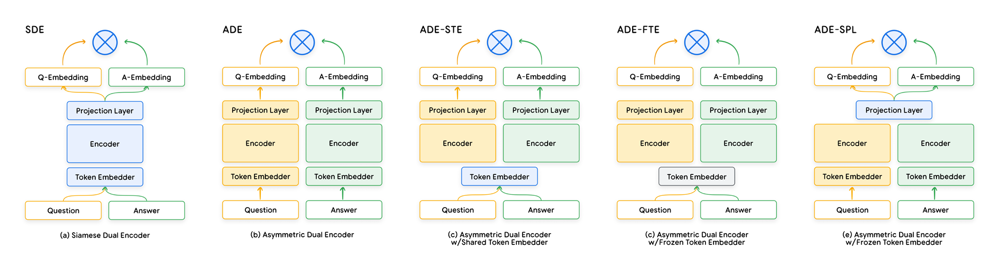
Figure 10. Some architectures of dual encoders

嵌入模型训练中所使用的损失函数通常是**对比损失（Contrastive Loss）**的一种变体，它以“<输入, 正样本, [可选] 负样本>”这一三元组作为输入。使用对比损失进行训练可以使正样本在空间距离上更接近，而使负样本彼此远离。 

与基础模型（Foundation Model）的训练类似，从零开始训练嵌入模型通常包括两个阶段：**预训练（无监督学习）**和**微调（有监督学习）**。如今，嵌入模型通常直接基于 BERT、T5、GPT、Gemini、CoCa 等基础模型进行初始化。通过这些基础模型，您可以充分利用其在大规模预训练中所习得的海量知识。嵌入模型的微调可以分为一个或多个阶段。微调数据集的创建方法多种多样，包括人工标注、合成数据集生成、模型蒸馏（Model Distillation）以及**难负样本挖掘（Hard Negative Mining）**。 

若要将嵌入用于分类或命名实体识别（NER）等下游任务，可以在嵌入模型之上添加额外的层（例如 Softmax 分类层）。在此过程中，嵌入模型既可以被**冻结（Frozen）**——这在训练数据集较小时尤为常见，也可以从头开始训练，或者与下游任务同步进行微调。 

Vertex AI 提供了定制其文本嵌入模型的功能。用户也可以选择直接进行模型微调，例如通过 TensorFlow Model Garden 微调 BERT 模型。此外，您还可以直接从 tfhub 加载嵌入模型并在此基础上进行微调。代码片段 7（Snippet 7）演示了如何基于 tfhub 模型构建分类器。 
```python
# Can switch the embedding to different embeddings from different modalities on #
tfhub. Here we use the BERT model as an example.
tfhub_link = "https://tfhub.dev/tensorflow/bert_en_uncased_L-12_H-768_A-12/4"

class Classifier(tf.keras.Model):
	def __init__(self, num_classes):
		super(Classifier, self).__init__(name="prediction")
			self.encoder = hub.KerasLayer(tfhub_link, trainable=True)
		self.dropout = tf.keras.layers.Dropout(0.1)
		self.dense = tf.keras.layers.Dense(num_classes)
	def call(self, preprocessed_text):
		encoder_outputs = self.encoder(preprocessed_text)
		pooled_output = encoder_outputs["pooled_output"]
	x = self.dropout(pooled_output)
	x = self.dense(x)
	return x
```
Snippet 7. Creating a Keras model using trainable tfhub layer

到目前为止，您已经了解了各种类型的嵌入、针对不同数据模态的训练技术与最佳实践，以及它们的典型应用。下一节将讨论如何以快速且可扩展的方式，针对生产环境的负载对已生成的嵌入进行持久化（Persist）与搜索。


### 向量搜索（Vector Search）

多年来，全文关键词搜索一直是现代 IT 系统的核心支柱。全文搜索引擎和数据库（无论是关系型还是非关系型）通常依赖于**精确的关键词匹配**。例如，如果你搜索“卡布奇诺（cappuccino）”，搜索引擎或数据库会返回所有在标签或文本描述中提到该确切查询词的文档。然而，如果关键词拼写错误，或者用户使用了不同的措辞来描述，传统的关键词搜索往往会返回错误的结果甚至没有结果。虽然传统方法中也有一些能够容忍拼写错误或印刷错误的技术，但它们仍然无法找到与查询词在底层语义上最接近的结果。 这正是**向量搜索**的强大之处：它利用文档的向量化（即嵌入式）语义表示。由于向量搜索适用于任何形式的嵌入，因此除了文本之外，它还支持对图像、视频及其他数据类型进行搜索。 

向量搜索让你能够超越查询词的字面含义，实现跨多种数据模态的语义搜索。这意味着即使措辞不同，你也能找到相关的结果。其基本流程是：首先建立一个可以计算各种项目嵌入的函数，计算目标项目的嵌入并将其存入数据库；随后，将输入的查询词映射到与项目相同的向量空间中；最后，寻找与该查询词最匹配的项目。 这个过程类似于在整个待搜索的向量集合中寻找最“相似”的匹配项。向量间的相似度可以通过以下度量标准来计算： 
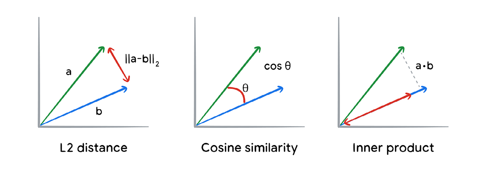
Figure 11. Visualization of how different metrics compute vector similarity

* **欧几里得距离（Euclidean distance，即 L2 距离）**：向量空间中两点之间的几何距离，在低维空间表现良好。
* **余弦相似度（Cosine similarity）**：衡量两个向量之间夹角的度量。
* **内积/点积（Inner/Dot product）**：一个向量在另一个向量上的投影。当向量范数为 1 时，内积与余弦相似度等价。这在高维数据中往往表现更好。 
***向量数据库*** 能够存储并帮助管理大规模向量搜索的复杂性，在实现工程化应用的同时，也满足了通用数据库的常规需求。 
#### 重要的向量搜索算法 
寻找最相似匹配项最直接的方法是进行传统的**线性搜索**（即暴力搜索），即将查询向量与每个文档向量进行对比，并返回相似度最高的一项。然而，这种方法的运行时间随文档数量 $N$ 呈线性增长（复杂度为 $O(N)$）。对于涉及数百万甚至更多文档的用例，这种速度是无法接受的。 因此，使用**近似最近邻（ANN）搜索**更为务实。ANN 是一种在允许微小误差范围内、寻找数据集中最接近点的技术。由于它将搜索空间大幅缩减至 $O(\log N)$，所需的计算量显著降低。ANN 包含多种方法，在规模、索引时间、性能和简易性之间各有权衡。它们通常采用以下一种或多种技术实现：**量化（Quantization）、哈希（Hashing）、聚类（Clustering）和树结构（Trees）**。 以下是一些主流方法的讨论： 
##### 局部敏感哈希（LSH）与树结构 **
局部敏感哈希（LSH）** 是一种在大型数据集中寻找相似项的技术。它通过创建一个或多个哈希函数，以高概率将相似项映射到同一个“哈希桶（Hash bucket）”中。这意味着你可以通过仅查看同一桶（或相邻桶）中的候选项目并进行线性搜索，来快速找到相似项。这显著提升了特定半径范围内的查询速度。哈希函数/表的数量和桶的数量决定了召回率与速度、以及误报（False positive）与漏报之间的权衡。

对 LSH 的一个直观理解是：按邮政编码或社区名称对住宅进行分组。当某人想搬家时，你只需查看该社区内的住宅并寻找最匹配的项，而无需搜索全球。 **
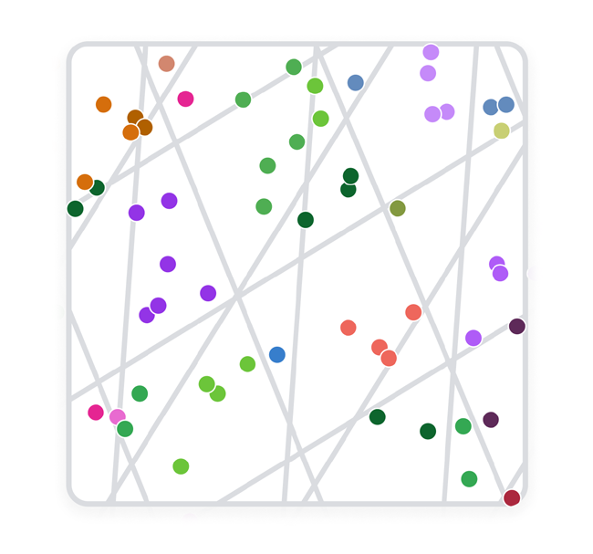
Figure 12. Visualization of how LSH uses random hyperplanes to partition the vector space

基于树的算法**运作方式类似。例如，**Kd-tree** 方法通过计算第一维度的中位数来创建决策边界，然后是第二维度，依此类推，其结构非常像决策树。然而，当搜索向量维度较高时，这种方法可能失效。在这种情况下，**Ball-tree** 算法更为适用——它不按维度中位数划分，而是根据数据点离中心的径向距离来创建桶。 哈希和树结构可以结合并扩展，以获得搜索算法在召回率和延迟之间的最优权衡。**FAISS 配合 HNSW** 以及 **ScaNN** 便是极佳的范例。 

### 分层可导航小世界**（通常简称为 **HNSW**）
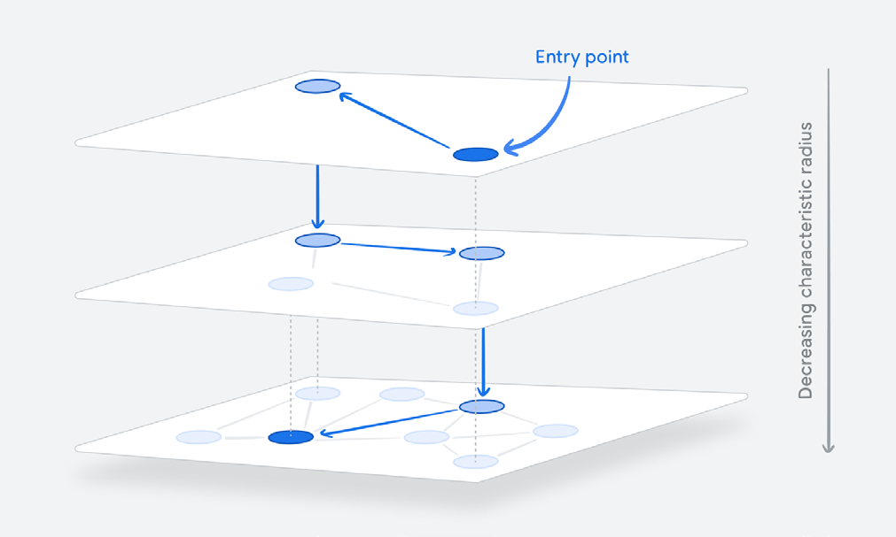
Figure 13. Diagram showing how HNSW ‘zooms in’ to perform ANN


##### FAISS 与 HNSW FAISS（Facebook AI 相似度搜索）的一种实现利用了**分层导航小世界（HNSW）**的概念，以亚线性（$O(\log N)$）的运行时间实现高精度的向量相似度搜索。HNSW 是一种具有分层结构的邻近图，图中的链接跨越不同的层。顶层拥有最长的链接，而底层拥有最短的链接。如图 13 所示，搜索从最顶层开始，算法贪婪地遍历图以找到与查询词语义最相似的顶点。一旦找到该层的局部最优解，它就会切换到下一层中与之最接近的顶点继续搜索。这一过程迭代进行，直到找到底层的局部最优解。该算法可以配合量化和向量索引来进一步提升速度和内存效率。 

```python
# Create an endpoint
my_index_endpoint = aiplatform.MatchingEngineIndexEndpoint.create(
	display_name=f"{DISPLAY_NAME}-endpoint", public_endpoint_enabled=True
)
# NOTE : This operation can take upto 20 minutes
my_index_endpoint = my_index_endpoint.deploy_index(
	index=my_index, deployed_index_id=DEPLOYED_INDEX_ID
)

# retrieve the id of the most recently deployed index or manually look up the index
deployed above
index_id=my_index_endpoint.deployed_indexes[-1].index.split("/")[-1]
endpoint_id= my_index_endpoint.name

# TODO : replace 1234567890123456789 with your acutial index ID
my_index = aiplatform.MatchingEngineIndex(index_id)

# TODO : replace 1234567890123456789 with your acutial endpoint ID
# Be aware that the Index ID differs from the endpoint ID
my_index_endpoint = aiplatform.MatchingEngineIndexEndpoint(endpoint_id)

# Input texts
texts= [
	"The earth is spherical.",
	"The earth is a planet.",
	"I like to eat at a restaurant.",
]

# Create a Vector Store
vector_store = VectorSearchVectorStore.from_components(
	project_id=PROJECT_ID,
	region=REGION,
	gcs_bucket_name=BUCKET,
	index_id=my_index.name,
	endpoint_id=my_index_endpoint.name,
	embedding=embedding_model,
	stream_update=True,
)

# Add vectors and mapped text chunks to your vectore store
vector_store.add_texts(texts=texts)

# Initialize the vectore_store as retriever
retriever = vector_store.as_retriever()

retriever=vector_store.as_retriever(search_kwargs={'k':1 })

#create custom prompt for your use case
prompt_template="""You are David, an AI knowledge bot.
Answer the questions using the facts provided. Use the provided pieces of context to answer
the users question.
If you don't know the answer, just say that "I don't know", don't try to make up an answer.
{summaries}"""

messages = [
	SystemMessagePromptTemplate.from_template(prompt_template),
	HumanMessagePromptTemplate.from_template("{question}")
]
prompt = ChatPromptTemplate.from_messages(messages)

chain_type_kwargs = {"question": prompt}

#initialize your llm model
llm = VertexAI(model_name="gemini-pro")

#build your chain for RAG+C
chain= RetrievalQA.from_chain_type(llm=llm, chain_type="stuff",
retriever=retriever, return_source_documents=True)

#print your results with Markup language
def print_result(result):
	output_text = f"""### Question:
	{query}
	### Answer:
	{result['result']}
	### Source:
	{' '.join(list(set([doc.page_content for doc in result['source_documents']])))}
	"""
	return(output_text)
	
chain= "What shape is the planet where humans live?"
result = chain(query)
display(Markdown(print_result(result)))
```
Snippet 9. Build/deploy ANN Index for Vertex AI Vector Search and use RAG with LLM prompts to generate
grounded results/sources.

```python
import faiss
M=32 #creating high degree graph:higher recall for larger index & searching time
d=768 # dimensions of the vectors/embeddings
index = faiss.IndexHNSWFlat(d, M)
index.add(embedded_test_items) #build the index using the embeddings in Snippet 9
#execute the ANN search
index.search(np.expand_dims(embedded_query, axis=0), k=2)
```
##### ScaNN 
Google 开发了**可扩展近似最近邻（ScaNN）**方法，并将其广泛应用于旗下的众多产品和服务中。目前，Google Cloud 的客户可以通过 Vertex AI 向量搜索以及包括 AlloyDB、Cloud Spanner 和 Cloud SQL 在内的云数据库使用该技术。

以下是 ScaNN 执行高效向量搜索的关键步骤： 
1. **分区（Partitioning，训练阶段可选）**：利用算法将向量库划分为逻辑分区/聚类，将语义相关的向量归为一类。对于超过 10 万个嵌入向量的大型数据集，分区至关重要，因为它通过“剪枝（Pruning）”搜索空间，能将搜索范围降低几个数量级，从而显著提升查询速度。分区的数量越多，召回率越高，但创建索引的时间也越长。一个常用的经验法则是将分区数设置为向量总数的平方根。 
2. **评分（Scoring，查询阶段）**：ScaNN 首先选择预设数量的顶层分区，然后将查询词与这些分区中的所有点进行对比。距离计算可以配置为**精确距离**或**近似距离**。 
3. **各向异性量化（Anisotropic Quantization）**：这是 ScaNN 的核心技术，相比传统的乘积量化（Product Quantization），它在速度和精度之间提供了更好的权衡。 
4. **重排序（Rescoring，可选）**：用户可以选择对得分最高的 K 个结果进行更精确的重新评分。这使得 ScaNN 拥有行业领先的性能表现（见图 14）。

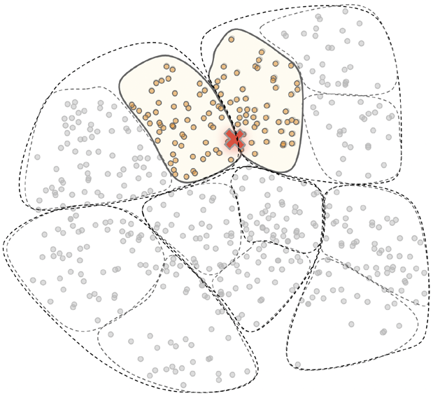


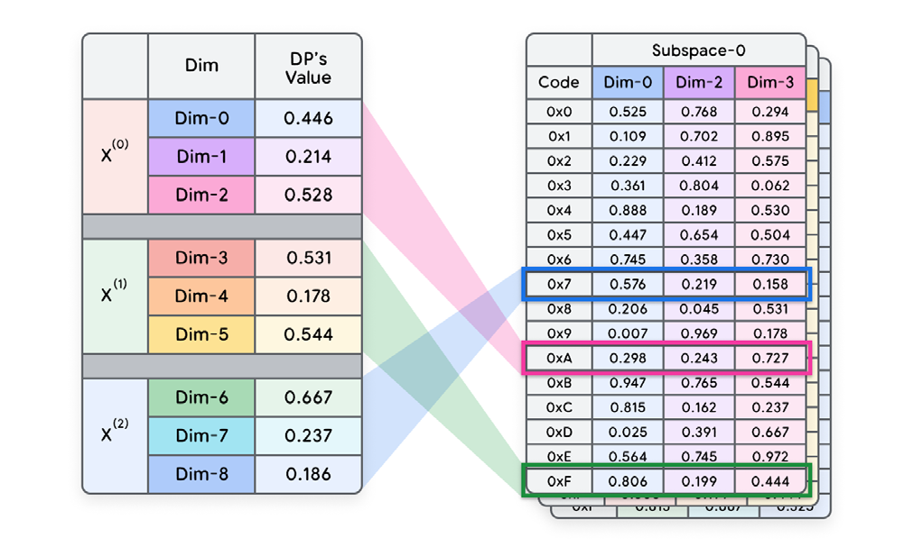
Figure 14. Search space partitioning & pruning (left) & Approximate scoring (right)

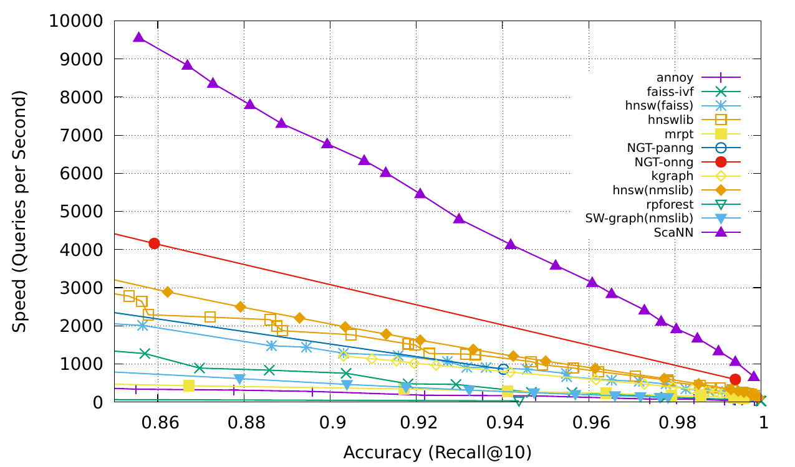
Figure 15. Accuracy/speed tradeoffs for various SOTA ANN search algorithms58

```python
import tensorflow as tf
import tensorflow_recommenders as tfrs
from vertexai.language_models import TextEmbeddingModel, TextEmbeddingInput

# Embed documents & query(from snip 9.) and convert them to tensors and tf.datasets
embedded_query = tf.constant((LM_embed(query, "RETRIEVAL_QUERY")))
embedded_docs = [LM_embed(doc, "RETIREVAL_DOCUMENT") for doc in searchable_docs]
embedded_docs = tf.data.Dataset.from_tensor_slices(embedded_docs).enumerate().batch(1)

# Build index from tensorflow dataset and execute ANN search based on dot product metric
scann = tfrs.layers.factorized_top_k.ScaNN(
	distance_measure= 'dot_product',
	num_leaves = 4, #increase for higher number of partitions / latency for increased recall
	num_leaves_to_search= 2) # increase for higher recall but increased latency
scann = scann.index_from_dataset(embedded_docs)
scann(embedded_query, k=2)
```
 Snippet 11. Using Tensorflow Recommenders33 to perform ANN search using the ScaNN algorithm
 
 在本白皮书中，我们探讨了从传统到现代的 ANN 搜索算法（ScaNN、FAISS、LSH、KD-Tree 和 Ball-tree），并分析了它们在速度与精度平衡方面的卓越表现。然而，要以可扩展、安全且生产就绪的方式部署这些算法，我们需要**向量数据库**。


# 向量数据库（Vector Databases）
向量嵌入体现了数据的语义，而向量搜索算法则提供了高效查询这些嵌入的方法。从历史上看，传统数据库缺乏将语义含义与高效查询相结合的手段。这便促成了**向量数据库**的兴起，它们从底层构建，专门用于在生产场景中管理这些嵌入。随着近期生成式 AI 的普及，越来越多的传统数据库开始在传统搜索功能之外，加入对向量搜索的支持（即“**混合搜索**”功能）。 

让我们来看一下一个具有混合搜索能力的简单向量数据库的工作流程。虽然每个向量数据库的实现各不相同，但通用流程如图 16 所示：

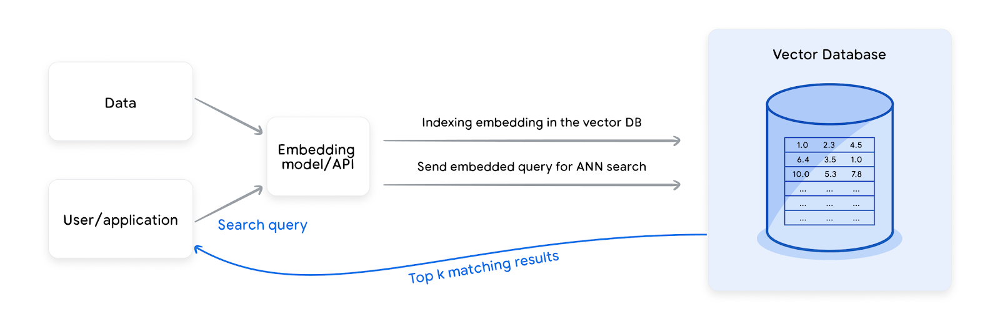
Figure 16. Populating and querying vector databases

1. **嵌入生成**：使用经过训练的合适嵌入模型，将相关数据点映射为固定维度的向量。
2. **索引构建**：随后，通过适当的元数据（Metadata）和补充信息（如标签）对向量进行增强，并使用指定的算法进行索引，以实现高效搜索。 
3. **查询与检索**：输入的查询由相应的模型进行嵌入，并用于搜索语义最相似的项目及其关联的非嵌入内容或元数据。 一些数据库可能还提供**缓存**、**预过滤**（基于标签的过滤）和**后过滤**功能（如使用另一个更准确的模型进行重排序），以进一步提升查询速度和性能。 

如今市面上已有相当多的向量数据库，每种都针对不同的业务需求和考量而量身定制。商业管理型向量数据库的代表包括 Google Cloud 的 **Vertex AI Vector Search**、**AlloyDB** 与 **Cloud SQL Postgres**、**ElasticSearch** 以及 **Pinecone** 等。 * **Vertex AI Vector Search**：由 Google 构建，采用 ScaNN 算法实现极速向量搜索，同时具备 Google Cloud 的所有安全和访问保障。 * **AlloyDB 与 Cloud SQL Postgres**：通过开源的 `pgvector` 扩展支持向量搜索，允许在 SQL 查询中将 ANN（近似最近邻）搜索与传统谓词（Predicates）相结合，并为 ANN 索引提供常规的**事务语义（Transactional semantics）**。此外，AlloyDB 还提供了一个原生的 ScaNN 索引扩展，且与 `pgvector` 兼容。 * **Pinecone 与 Weaviate**：利用 HNSW 算法实现快速向量搜索，并具备结合传统搜索进行数据过滤的能力。 * **开源领域**：**Weaviate** 和 **ChromaDB** 在部署后提供全套功能，并且支持在原型设计（Prototyping）阶段直接在内存中进行测试。


### 运维考量
向量数据库对于管理在大规模存储和查询嵌入向量时出现的多数技术挑战至关重要。其中一些挑战是向量存储特有的，而另一些则与传统数据库重叠。这些挑战包括：水平与垂直扩展性、可用性、数据一致性、实时更新、备份、访问控制、合规性等。然而，在使用嵌入和向量存储时，还有许多额外的挑战和因素需要考虑。

**首先，嵌入向量与传统内容不同，它们会随着时间而演变（Mutate）。** 这意味着，同一段文本、图像、视频或其他内容，可能且应当使用不同的嵌入模型进行编码，以优化下游应用的性能。对于有监督模型（Supervised models）尤其如此——当模型为了应对各种“数据漂移（Drifts）”或目标变化而重新训练后，嵌入也需随之更新。同理，当无监督模型升级到新版本时也面临同样的情况。然而，频繁更新嵌入向量（特别是针对海量数据训练的向量）的成本可能极其高昂。因此，必须在性能与预算之间取得平衡。这需要建立一套明确的自动化流程，在考虑预算的前提下，对向量数据库中的嵌入进行存储、管理以及可能的清理（Purge）。

**其次，虽然嵌入向量擅长表示语义信息，但有时在表示字面（Literal）或语法（Syntactic）信息时效果欠佳。** 对于特定领域的词汇或 ID 类数据，这一点尤为明显。这些值在嵌入模型训练所用的数据中可能缺失或代表性不足。例如，如果用户输入的查询包含一个特定的数字 ID 和大量文本，模型可能会找到语义上与文本高度匹配的邻居，但却忽略了 ID，而 ID 往往是该语境下最重要的部分。你可以通过**混合搜索**的方法来克服这一挑战：即在进入语义搜索模块之前，先利用全文搜索对搜索空间进行预过滤（Pre-filter）或后过滤（Post-filter）。

**另一个需要考虑的重要点是，应根据语义查询所属的负载类型选择不同的向量数据库。** 例如： * 对于需要频繁读写操作的 **OLTP（联机事务处理）** 负载，AlloyDB、Spanner、Postgres 或 Cloud SQL 等运营级数据库是最佳选择。 * 对于大规模的 **OLAP（联机分析处理）** 分析负载和批处理用例，则更倾向于使用 BigQuery 的向量搜索功能。

**总结**：在选择向量数据库时，需要综合考虑多种因素。这些因素包括数据集的大小和类型（有些擅长处理稀疏向量，有些擅长稠密向量）、业务需求、负载性质、预算、安全性、隐私保障、对语义及字面搜索的需求，以及现有的数据库生态。在本节中，我们探讨了各种 ANN 搜索方法，以及使用向量数据库的必要性与优势。下一节将演示如何使用 Vertex AI 向量搜索进行语义搜索的示例。

# 应用场景

嵌入模型是驱动多种应用的核心机器学习模型之一。下表总结了一些热门的应用场景：

| task                               | Description                                                                                              |
| ---------------------------------- | -------------------------------------------------------------------------------------------------------- |
| 检索 (Retrieval)                     | 给定一个查询（Query）和一组对象（例如文档、图像和视频），从中检索出最相关的对象。根据相关对象的定义，子任务包括**问答系统**和**推荐系统**                              |
| 语义文本相似度 (Semantic text similarity) | 判断两个句子是否具有相同的语义含义。子任务包括：**复述/改写（Paraphrasing）**、**重复检测（Duplicate detection）**以及**双语语料挖掘（Bitext mining）** |
| 分类 (Classification)                | 将对象划分到可能的类别中。根据标签的数量，子任务包括**二分类**、**多分类**和**多标签分类**                                                      |
| 聚类 (Clustering)                    | 将相似的对象聚集在一起                                                                                              |
| 重排序 (Reranking)                    | 根据特定的查询，对一组已有的对象重新进行排序                                                                                   |

嵌入技术与提供近似最近邻（ANN）功能的向量存储相结合，构成了极其强大的工具集，可广泛应用于多种场景。其中包括用于大语言模型（LLM）的检索增强生成（RAG）、搜索引擎、推荐系统、异常检测、少样本分类等。 

对于搜索和推荐等排序类问题，嵌入通常用于流程的第一阶段（即“召回”阶段）。它们能够检索出语义相似的潜在候选对象，进而提升搜索结果的相关性。由于待筛选的信息量往往极其庞大（有时甚至涉及数百万或数十亿条数据），像 ScaNN 这样的 ANN 技术在实现可扩展地缩小搜索空间方面起到了至关重要的作用。在此基础上，这一初始结果集还可以通过更复杂的模型，在较小的候选集上进行进一步的精炼（即“精排”）。 

下面，让我们来看一个结合了大语言模型（LLM）与检索增强生成（RAG）来辅助问答的具体应用示例。

# Q&A带有溯源的问答（检索增强生成）
用于问答的**检索增强生成（RAG）**是一种结合了检索与生成两者优点的技术。它首先从知识库中检索相关文档，然后通过**提示词扩展（Prompt Expansion）**利用这些文档生成答案。提示词扩展是一种与数据库搜索结合时非常强大的技术。通过提示词扩展，模型从数据库中检索相关信息（通常结合语义搜索和业务规则），并以此增强原始提示词。相比单纯的检索或生成，模型利用这种增强后的提示词可以生成更有趣、更具事实性且信息量更丰富的内容。

RAG 可以帮助解决大语言模型（LLM）的两个常见问题： 1. **“幻觉（Hallucinate）”倾向**：即模型容易生成事实错误但听起来颇为合理的回复。 2. **更新信息的成本高昂**：为了跟上最新信息，重新训练模型成本极高，而 RAG 允许通过提示词（而非模型训练）直接提供最新数据。 

尽管 RAG 可以减少幻觉，但无法完全消除它们。进一步缓解这一问题的方法是：在返回答案的同时**返回检索到的来源（Sources）**，并由人工或另一个 LLM 进行快速的**一致性检查（Coherence Check）**。这能确保 LLM 的回复与语义相关的原始资料保持一致。 

让我们来看一个带有溯源功能的 RAG 示例（代码片段 11）。该方案可以利用 Vertex AI LLM 文本嵌入、Vertex AI 向量搜索并结合 LangChain 等库来实现可扩展的工程化部署。

```python
# Before you start run this command:
# pip install --upgrade --user --quiet google-cloud-aiplatform langchain_google_vertexai
# after running pip install make sure you restart your kernel
# TODO : Set values as per your requirements
# Project and Storage Constants
PROJECT_ID = "<my_project_id>"
REGION = "<my_region>"
BUCKET = "<my_gcs_bucket>"
BUCKET_URI = f"gs://{BUCKET}"
# The number of dimensions for the text-embedding-005 is 768
# If other embedder is used, the dimensions would probably need to change.
DIMENSIONS = 768
# Index Constants
DISPLAY_NAME = "<my_matching_engine_index_id>"
DEPLOYED_INDEX_ID = "yourname01" # you set this. Start with a letter.
from google.cloud import aiplatform
from langchain_google_vertexai import VertexAIEmbeddings
from langchain_google_vertexai import VertexAI
from langchain_google_vertexai import (
VectorSearchVectorStore,
VectorSearchVectorStoreDatastore,
)
from langchain.chains import RetrievalQA
from langchain.prompts.chat import (
ChatPromptTemplate,
SystemMessagePromptTemplate,
HumanMessagePromptTemplate,
)
from IPython.display import display, Markdown
aiplatform.init(project=PROJECT_ID, location=REGION, staging_bucket=BUCKET_URI)
embedding_model = VertexAIEmbeddings(model_name="text-embedding-005")
# NOTE : This operation can take upto 30 seconds
my_index = aiplatform.MatchingEngineIndtex.create_tree_ah_index(
display_name=DISPLAY_NAME,
dimensions=DIMENSIONS,
approximate_neighbors_count=150,
distance_measure_type="DOT_PRODUCT_DISTANCE",
index_update_method="STREAM_UPDATE", # allowed values BATCH_UPDATE , STREAM_UPDATE
)
# Create an endpoint
my_index_endpoint = aiplatform.MatchingEngineIndexEndpoint.create(
display_name=f"{DISPLAY_NAME}-endpoint", public_endpoint_enabled=True
)
# NOTE : This operation can take upto 20 minutes
my_index_endpoint = my_index_endpoint.deploy_index(
index=my_index, deployed_index_id=DEPLOYED_INDEX_ID
)
my_index_endpoint = my_index_endpoint.deploy_index(
index=my_index, deployed_index_id=DEPLOYED_INDEX_ID
)
my_index_endpoint.deployed_indexes
# TODO : replace 1234567890123456789 with your acutial index ID
my_index = aiplatform.MatchingEngineIndex("1234567890123456789")
# TODO : replace 1234567890123456789 with your acutial endpoint ID
# Be aware that the Index ID differs from the endpoint ID
my_index_endpoint = aiplatform.MatchingEngineIndexEndpoint("1234567890123456789")
from langchain_google_vertexai import (
VectorSearchVectorStore,
VectorSearchVectorStoreDatastore,
)
# Input texts
texts = [
"The cat sat on",
"the mat.",
"I like to",
"eat pizza for",
"dinner.",
"The sun sets",
"in the west.",
]
# Create a Vector Store
vector_store = VectorSearchVectorStore.from_components(
project_id=PROJECT_ID,
region=REGION,
gcs_bucket_name=BUCKET,
index_id=my_index.name,
endpoint_id=my_index_endpoint.name,
embedding=embedding_model,
stream_update=True,
)
# Add vectors and mapped text chunks to your vectore store
vector_store.add_texts(texts=texts)
# Initialize the vectore_store as retriever
retriever = vector_store.as_retriever()
# perform simple similarity search on retriever
retriever.invoke("What are my options in breathable fabric?")
```
Snippet 12. Build/deploy ANN Index for Vertex AI Vector Search and use RAG with LLM prompts to generate
grounded results/sources.

![[page_57_img_1.png]]![[page_57_img_2.png]]
Figure 17. Model responses along with sources demonstrating the LLM being grounded in the database

  
正如我们从图 16 中可以推断出的，该输出不仅使 LLM 的回复**锚定（Grounding）**在从数据库检索到的语义相似结果之上（因此，当数据库中找不到上下文时，模型会拒绝回答），这不仅显著减少了幻觉，还提供了可供人工或另一个 LLM 进行核实的来源。

# 总结
在本白皮书中，我们讨论了在生产级应用背景下，如何有效地创建、管理、存储和检索各种数据模态的嵌入。为下游应用创建、维护和使用嵌入是一项复杂的任务，涉及组织内的多个角色。然而，通过全面地实现其使用的工程化（Operationalizing）和自动化，您可以安全地利用嵌入在一些最重要应用中所带来的巨大优势。 

本白皮书的一些关键要点包括： 
1. **根据您的数据和用例明智地选择嵌入模型。** 确保推理（Inference）时使用的数据与训练时使用的数据保持一致。从训练到推理的**分布偏移（Distribution shift）**可能源于多个方面，包括领域分布偏移或下游任务分布偏移。如果现有模型无法适配当前的推理数据分布，对模型进行微调（Fine-tuning）将显著提升性能。另一个权衡点在于**模型大小**：基于大型深度神经网络（大型多模态模型）的模型通常性能更好，但代价是更高的推理延迟。使用云端嵌入服务可以通过提供高质量、低延迟的嵌入服务来解决这一矛盾。对于大多数商业应用，预训练模型是一个良好的基准，随后可对其进行进一步微调或集成。若数据具有内在的图结构，图嵌入则能提供卓越的性能。
2. **确定嵌入策略后，选择适合预算和业务需求的向量数据库至关重要。** 虽然使用开源替代方案进行原型设计可能看起来更快，但选择一个更安全、可扩展且经过实战测试的**托管向量数据库**可以节省大量的开发时间。在众多强大的 ANN 向量搜索算法中，**ScaNN** 和 **HNSW** 已被证明在精度与性能的权衡上表现最为出色。 
3. **嵌入技术与高效的 ANN 向量数据库相结合是极具威力的工具。** 它可以广泛应用于搜索、推荐系统以及 LLM 的检索增强生成（RAG）。这种方法能够缓解大语言模型的幻觉问题，并增强基于 LLM 系统的可验证性和信任度。


Endnotes
1. Rai, A., 2020, Study of various methods for tokenization. In Advances in Natural Language Processing.
Available at: https://doi.org/10.1007/978-981-15-6198-6_18
2. Pennington, J., Socher, R. & Manning, C., 2014, GloVe: Global Vectors for Word Representation. [online]
Available at: https://nlp.stanford.edu/pubs/glove.pdf.
3. Shazeer, N., Mirhoseini, A., Maziarz, K., Davis, A., Le, Q. V. & Hinton, G., 2016, Swivel: Improving embeddings
by noticing what's missing. ArXiv, abs/1602.02215. Available at: https://arxiv.org/abs/1602.02215.
4. Mikolov, T., Sutskever, I., Chen, K., Corrado, G. & Dean, J., 2013, Efficient estimation of word representations
in vector space. ArXiv, abs/1301.3781. Available at: https://arxiv.org/pdf/1301.3781.pdf.
5. Rehurek, R., 2021, Gensim: open source python library for word and document embeddings. Available
at: https://radimrehurek.com/gensim/intro.html.
6. Bojanowski, P., Grave, E., Joulin, A. & Mikolov, T., 2016, Enriching word vectors with subword information.
ArXiv, abs/1607.04606. Available at: https://arxiv.org/abs/1607.04606.
7. Deerwester, S., Dumais, S. T., Furnas, G. W., Landauer, T. K., & Harshman, R., 1990, Indexing by latent
semantic analysis. Journal of the American Society for Information Science, 41(6), pp. 391-407.
8. Blei, D. M., Ng, A. Y., & Jordan, M. I., 2001, Latent Dirichlet allocation. In T. G. Dietterich, S. Becker, & Z.
Ghahramani (Eds.), Advances in Neural Information Processing Systems 14. MIT Press, pp. 601-608. Available
at: https://proceedings.neurips.cc/paper/2001/hash/296472c9542ad4d4788d543508116cbc-Abstract.html.
9. Muennighoff, N., Tazi, N., Magne, L., & Reimers, N., 2022, Mteb: Massive text embedding benchmark. ArXiv,
abs/2210.07316. Available at: https://arxiv.org/abs/2210.07316.
10. Le, Q. V., Mikolov, T., 2014, Distributed representations of sentences and documents. ArXiv, abs/1405.4053.
Available at: https://arxiv.org/abs/1405.4053.
11. Devlin, J., Chang, M. W., Lee, K., & Toutanova, K., 2019, BERT: Pre-training deep Bidirectional Transformers
for Language Understanding. In Proceedings of the 2019 Conference of the North American Chapter of the
Association for Computational Linguistics: Human Language Technologies, Volume 1 (Long and Short Papers),
pp. 4171-4186. Available at: https://www.aclweb.org/anthology/N19-1423/.
12. Reimers, N. & Gurevych, I., 2020, Making monolingual sentence embeddings multilingual using knowledge
distillation. In Proceedings of the 2020 Conference on Empirical Methods in Natural Language Processing
(EMNLP), pp. 254-265. Available at: https://www.aclweb.org/anthology/2020.emnlp-main.21/.
13. Gao, T., Yao, X. & Chen, D., 2021, Simcse: Simple contrastive learning of sentence embeddings. ArXiv,
abs/2104.08821. Available at: https://arxiv.org/abs/2104.08821.
14. Wang, L., Yang, N., Huang, X., Jiao, B., Yang, L., Jiang, D., Majumder, R. & Wei, F., 2022, Text embeddings by
weakly supervised contrastive pre-training. ArXiv. Available at: https://arxiv.org/abs/2201.01279.
15. Khattab, O. & Zaharia, M., 2020, colBERT: Efficient and effective passage search via contextualized late
interaction over BERT. In Proceedings of the 43rd International ACM SIGIR Conference on Research and
Development in Information Retrieval, pp. 39-48. Available at: https://dl.acm.org/doi/10.1145/3397271.3401025.
16. Lee, J., Dai, Z., Duddu, S. M. K., Lei, T., Naim, I., Chang, M. W. & Zhao, V. Y., 2023, Rethinking the role of token
retrieval in multi-vector retrieval. ArXiv, abs/2304.01982. Available at: https://arxiv.org/abs/2304.01982.
17. TensorFlow, 2021, TensorFlow hub, a model zoo with several easy to use pre-trained models. Available
at: https://tfhub.dev/.
18. Zhang, W., Xiong, C., & Zhao, H., 2023, Introducing BigQuery text embeddings for NLP tasks.
Google Cloud Blog. Available at: https://cloud.google.com/blog/products/data-analytics/introducing
-bigquery-text-embeddings.
19. Google Cloud, 2024, Get multimodal embeddings. Available at:
https://cloud.google.com/vertex-ai/generative-ai/docs/embeddings/get-multimodal-embeddings.
20. Pinecone, 2024, IT Threat Detection. [online] Available at: https://docs.pinecone.io/docs/it-threat-detection.
21. Cai, H., Zheng, V. W., & Chang, K. C., 2020, A survey of algorithms and applications related with graph
embedding. In Proceedings of the 29th ACM International Conference on Information & Knowledge
Management. Available at: https://dl.acm.org/doi/10.1145/3444370.3444568.
22. Cai, H., Zheng, V. W., & Chang, K. C., 2017, A comprehensive survey of graph embedding: problems,
techniques and applications. ArXiv, abs/1709.07604. Available at: https://arxiv.org/pdf/1709.07604.pdf.
23. Hamilton, W. L., Ying, R. & Leskovec, J., 2017, Inductive representation learning on large graphs.
In Advances in Neural Information Processing Systems 30. Available at:
https://cs.stanford.edu/people/jure/pubs/graphsage -nips17.pdf.
24. Dong, Z., Ni, J., Bikel, D. M., Alfonseca, E., Wang, Y., Qu, C. & Zitouni, I., 2022, Exploring dual encoder
architectures for question answering. ArXiv, abs/2204.07120. Available at: https://arxiv.org/abs/2204.07120.
25. Google Cloud, 2021, Vertex AI Generative AI: Tune Embeddings. Available at:
https://cloud.google.com/vertex-ai/docs/generative-ai/models/tune-embeddings.
26. Matsui, Y., 2020, Survey on approximate nearest neighbor methods. ACM Computing Surveys (CSUR), 53(6),
Article 123. Available at: https://wangzwhu.github.io/home/file/acmmm-t-part3-ann.pdf.
27. Friedman, J. H., Bentley, J. L. & Finkel, R. A., 1977, An algorithm for finding best matches in logarithmic
expected time. ACM Transactions on Mathematical Software (TOMS), 3(3), pp. 209-226. Available at:
https://dl.acm.org/doi/pdf/10.1145/355744.355745.
28. Scikit-learn, 2021, Scikit-learn, a library for unsupervised and supervised neighbors-based learning methods.
Available at: https://scikit-learn.org/.
29. lshashing, 2021, An open source python library to perform locality sensitive hashing. Available at:
https://pypi.org/project/lshashing/.
30. Malkov, Y. A., Yashunin, D. A., 2016, Efficient and robust approximate nearest neighbor search using
hierarchical navigable small world graphs. ArXiv, abs/1603.09320. Available at:
https://arxiv.org/pdf/1603.09320.pdf.
31. Google Research, 2021, A library for fast ANN by Google using the ScaNN algorithm. Available at:
https://github.com/google-research/google-research/tree/master/scann.
32. Guo, R., Zhang, L., Hinton, G. & Zoph, B., 2020, Accelerating large-scale inference with anisotropic vector
quantization. ArXiv, abs/1908.10396. Available at: https://arxiv.org/pdf/1908.10396.pdf.
33. TensorFlow, 2021, TensorFlow Recommenders, an open source library for building ranking & recommender
system models. Available at: https://www.tensorflow.org/recommenders.
34. Google Cloud, 2021, Vertex AI Vector Search, Google Cloud’s high-scale low latency vector database.
Available at: https://cloud.google.com/vertex-ai/docs/vector-search/overview.
35. Elasticsearch, 2021, Elasticsearch: a RESTful search and analytics engine. Available at:
https://www.elastic.co/elasticsearch/.
36. Pinecone, 2021, Pinecone, a commercial fully managed vector database. Available at:
https://www.pinecone.io.
37. pgvector, 2021, Open Source vector similarity search for Postgres. Available at:
https://github.com/pgvector/pgvector.
38. Weaviate, 2021, Weaviate, an open source vector database. Available at: https://weaviate.io/.
39. ChromaDB, 2021, ChromaDB, an open source vector database. Available at: https://www.trychroma.com/.
40. 40. LangChain, 2021.,LangChain, an open source framework for developing applications powered by language
model. Available at: https://langchain.com.
41. Thakur, N., Reimers, N., Ruckl'e, A., Srivastava, A., & Gurevych, I. (2021). BEIR: A Heterogenous Benchmark for
Zero-shot Evaluation of Information Retrieval Models. ArXiv, abs/2104.08663.
Available at: https://github.com/beir-cellar/beir
42. Niklas Muennighoff, Nouamane Tazi, Loic Magne, and Nils Reimers. 2023. MTEB: Massive Text Embedding
Benchmark. In Proceedings of the 17th Conference of the European Chapter of the Association for
Computational Linguistics, pages 2014–2037, Dubrovnik, Croatia. Association for Computational Linguistics.
Available at: https://github.com/embeddings-benchmark/mteb
43. Chris Buckley. trec_eval IR evaluation package. Available from https://github.com/usnistgov/trec_eval
44. Christophe Van Gysel and Maarten de Rijke. 2018. Pytrec_eval: An Extremely Fast Python Interface to trec_
eval. In The 41st International ACM SIGIR Conference on Research & Development in Information Retrieval (SIGIR
'18). Association for Computing Machinery, New York, NY, USA, 873–876.
Availalbe at: https://doi.org/10.1145/3209978.3210065
45. Boteva, Vera & Gholipour Ghalandari, Demian & Sokolov, Artem & Riezler, Stefan. (2016). A Full-Text Learning
to Rank Dataset for Medical Information Retrieval. 9626. 716-722. 10.1007/978-3-319-30671-1_58. Available
at https://www.cl.uni-heidelberg.de/statnlpgroup/nfcorpus/
46. Douze, M., Guzhva, A., Deng, C., Johnson, J., Szilvasy, G., Mazaré, P.E., Lomeli, M., Hosseini, L. and Jégou, H.,
47. The Faiss library. arXiv preprint arXiv:2401.08281. Available at https://arxiv.org/abs/2401.08281
48. Lee, J., Dai, Z., Ren, X., Chen, B., Cer, D., Cole, J.R., Hui, K., Boratko, M., Kapadia, R., Ding, W. and Luan, Y.,
49. Gecko: Versatile text embeddings distilled from large language models. arXiv preprint arXiv:2403.20327.
Available at: https://arxiv.org/abs/2403.20327
50. Okapi BM25: a non-binary model” Christopher D. Manning, Prabhakar Raghavan, Hinrich Schütze. An
Introduction to Information Retrieval, Cambridge University Press, 2009, p. 232.
51. Colin Raffel, Noam Shazeer, Adam Roberts, Katherine Lee, Sharan Narang, Michael Matena, Yanqi Zhou, Wei
Li, and Peter J. Liu. 2020. Exploring the limits of transfer learning with a unified text-to-text transformer. J. Mach.
Learn. Res. 21, 1, Article 140 (January 2020), 67 pages.
Available at https://dl.acm.org/doi/abs/10.5555/3455716.3455856
52. Aakanksha Chowdhery, Sharan Narang, Jacob Devlin, Maarten Bosma, Gaurav Mishra, Adam Roberts,
Paul Barham, Hyung Won Chung, Charles Sutton, Sebastian Gehrmann, Parker Schuh, Kensen Shi, Sashank
Tsvyashchenko, Joshua Maynez, Abhishek Rao, Parker Barnes, Yi Tay, Noam Shazeer, Vinodkumar Prabhakaran,
Emily Reif, Nan Du, Ben Hutchinson, Reiner Pope, James Bradbury, Jacob Austin, Michael Isard, Guy Gur-Ari,
Pengcheng Yin, Toju Duke, Anselm Levskaya, Sanjay Ghemawat, Sunipa Dev, Henryk Michalewski, Xavier Garcia,
Vedant Misra, Kevin Robinson, Liam Fedus, Denny Zhou, Daphne Ippolito, David Luan, Hyeontaek Lim, Barret
Zoph, Alexander Spiridonov, Ryan Sepassi, David Dohan, Shivani Agrawal, Mark Omernick, Andrew M. Dai,
Thanumalayan Sankaranarayana Pillai, Marie Pellat, Aitor Lewkowycz, Erica Moreira, Rewon Child, Oleksandr
Polozov, Katherine Lee, Zongwei Zhou, Xuezhi Wang, Brennan Saeta, Mark Diaz, Orhan Firat, Michele Catasta,
Jason Wei, Kathy Meier-Hellstern, Douglas Eck, Jeff Dean, Slav Petrov, and Noah Fiedel. 2023. PaLM: scaling
language modeling with pathways. J. Mach. Learn. Res. 24, 1, Article 240 (January 2023), 113 pages.
Available at https://dl.acm.org/doi/10.5555/3648699.3648939
53. Gemini: A Family of Highly Capable Multimodal Models, Gemini Team, Dec 2023.
Available at: https://storage.googleapis.com/deepmind-media/gemini/gemini_1_report.pdf
54. Radford, Alec and Karthik Narasimhan. “Improving Language Understanding by Generative Pre-Training.”
(2018). Available at:
https://cdn.openai.com/research-covers/language-unsupervised/language_understanding_paper.pdf
55. Touvron, H., Lavril, T., Izacard, G., Martinet, X., Lachaux, M.A., Lacroix, T., Rozière, B., Goyal, N., Hambro,
E., Azhar, F. and Rodriguez, A., 2023. Llama: Open and efficient foundation language models. arXiv preprint
arXiv:2302.13971. Available at: https://arxiv.org/abs/2302.13971
56. Kusupati, A., Bhatt, G., Rege, A., Wallingford, M., Sinha, A., Ramanujan, V., Howard-Snyder, W., Chen, K.,
Kakade, S., Jain, P. and Farhadi, A., 2022. Matryoshka representation learning. Advances in Neural Information
Processing Systems, 35, pp.30233-30249. Available at:
https://proceedings.neurips.cc/paper_files/paper/2022/file/c32319f4868da7613d78af9993100e42-Paper-
-Conference.pdf
57. Nair, P., Datta, P., Dean, J., Jain, P. and Kusupati, A., 2025. Matryoshka Quantization. arXiv preprint
arXiv:2502.06786. Available at: https://arxiv.org/abs/2502.06786
58. Faysse, M., Sibille, H., Wu, T., Omrani, B., Viaud, G., Hudelot, C. and Colombo, P., 2024. Colpali: Efficient
document retrieval with vision language models. arXiv preprint arXiv:2407.01449.
Available at: https://arxiv.org/abs/2407.01449
59. Aumüller, M., Bernhardsson, E. and Faithfull, A., 2020. ANN-Benchmarks: A benchmarking tool for
approximate nearest neighbor algorithms. Information Systems, 87, p.101374.
