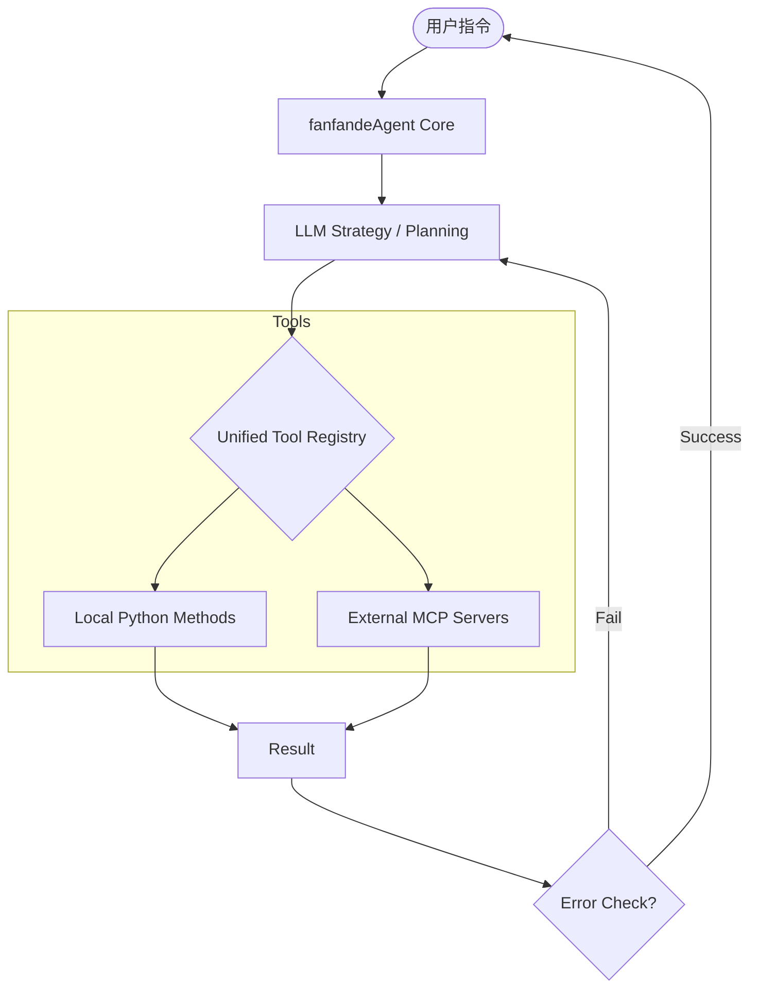

# 🚀 fanfandeAgent

[](https://www.python.org/)
[](LICENSE)
[](https://modelcontextprotocol.io/)

**fanfandeAgent** 是一个高性能、轻量级的异步 AI Agent 框架。它不仅解决了传统 Agent 难以扩展工具的痛点，更原生支持了 **Model Context Protocol (MCP)**，实现了本地私有工具与全球生态工具的无缝缝合。

> **Why fanfandeAgent?**
> 在大多数 Agent 框架还在手动编写 Tool 调用逻辑时，fanfandeAgent 已经通过统一注册表（Unified Registry）实现了“即插即用”的插件化架构。

---

## ✨ 核心特性

*   **🧩 混合动力工具箱 (Hybrid Tooling)**:
    *   **本地工具**：一键装饰 Python 函数作为 Agent 技能。
    *   **MCP 深度集成**：原生支持连接任意 MCP Server（通过 Stdio），直接使用 GitHub、Postgres、Browser 等海量社区工具。
*   **🛡️ 自修复执行引擎 (Self-Healing Engine)**:
    *   当工具返回错误或 LLM 参数生成有误时，框架会自动触发 **Reflection（反思）** 机制，尝试自我纠正并重新执行，大幅提升长链路任务成功率。
*   **🧠 增强型记忆管理**:
    *   基于滑动窗口的短期记忆 + 结构化上下文压缩，确保 Agent 在复杂对话中不迷失方向。
*   **⚡ 异步高并发设计**:
    *   底层基于 `asyncio` 构建，完美支持多工具并发调用与流式响应输出。

---

## 🏗️ 架构概览

`fanfandeAgent` 采用了分层解耦的设计理念，确保了极高的可扩展性：



---

## 🛠️ 快速开始

### 1. 安装
```bash
git clone https://github.com/yourname/fanfandeAgent.git
cd fanfandeAgent
pip install -r requirements.txt
```

### 2. 配置 MCP 工具 (`mcp_config.json`)
```json
{
  "mcpServers": {
    "filesystem": {
      "command": "npx",
      "args": ["-y", "@modelcontextprotocol/server-filesystem", "/Users/me/Documents"]
    }
  }
}
```

### 3. 运行你的第一个 Agent
```python
import asyncio
from fanfande_agent import FanfandeAgent, UnifiedRegistry

async def main():
    # 初始化工具注册表（合并本地与远程MCP工具）
    registry = UnifiedRegistry(config_path="mcp_config.json")
    
    # 定义一个简单的本地工具
    @registry.local_tool
    def get_user_status(user_id: str):
        """获取内部系统的用户状态"""
        return f"User {user_id} is currently VIP"

    # 启动 Agent
    agent = FanfandeAgent(api_key="your_key", registry=registry)
    
    await agent.chat("查询 VIP 用户 123 的文件夹里有哪些文件，并写一份总结。")

if __name__ == "__main__":
    asyncio.run(main())
```

---

## 🔍 思维链路追踪 (Thought Trace)

`fanfandeAgent` 提供了透明的思考过程展示，方便开发者调试：

```text
[THOUGHT]: 用户请求访问文件系统。我需要先列出目录内容。
[ACTION]: Calling MCP tool 'filesystem.list_directory' with {'path': '.'}
[OBSERVATION]: Found 'data.csv', 'report.pdf'.
[THOUGHT]: 目录已获取，现在读取 data.csv 进行总结。
[ACTION]: Calling MCP tool 'filesystem.read_file' with {'path': 'data.csv'}
...
```

---

## 🗺️ 路线图 (Roadmap)

- [x] 原生 MCP Stdio 支持
- [x] 本地工具装饰器
- [ ] 接入 SSE (Server-Sent Events) 远程 MCP 代理
- [ ] 多 Agent 协作模式（Supervisor 模式）
- [ ] 可视化 Web 调试看板

---

## 🤝 贡献与反馈

如果你对 `fanfandeAgent` 感兴趣，欢迎提 Issue 或 PR！

**Author:** [你的名字/ID]
**Email:** [你的邮箱]

---
